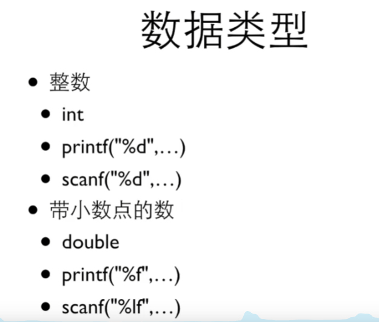

# C语言

## 1.编辑器和编译器

- Dev C++

- MS Visual Studio Express

## 2.第一段代码

~~~ c
#include <stdio.h>

int main()
{
	printf("Hello World!\n");
	
	return 0;	
} 

~~~

## 3.占位符

~~~ c
#include <stdio.h>

int main()
{
	//%d,占位符 
	printf("12+34=%d",12+34);
	
	return 0;	
} 
~~~

## 4.小的交互程序

~~~ c
#include <stdio.h>

int main()
{
	int price = 0;
	
	printf("请输入金额");
	scanf("%d",&price);
	
	int change = 100 - price;
	
	printf("找您%d元\n",change);
	 
	
	return 0;	
} 
~~~

## 5.常量定义

~~~c
	const int AMOUNT = 100; 
~~~

## 6.浮点数

~~~ c
printf("%f\n",10.0/3*3);
~~~

