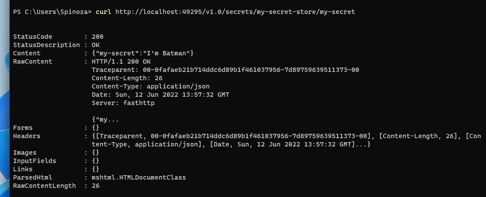

# dapr

## 1.第01期-Dapr简介与入门

​	Dapr 是一个可移植的、事件驱动的运行时，它使任何开发人员能够轻松构建出弹性的、无状态和有状态的应用程序，并可运行在云平台或边缘计算中，它同时也支持多种编程语言和开发框架，构建块与组件的区别，基于 Sidecar 架构，组件与实现，中间件管道，可观测性，传输安全性。

## 2.第02期-安装与快速入门

[dapr 安装](https://docs.dapr.io/getting-started/install-dapr-cli/) 

[离线安装包](https://v1-7.docs.dapr.io/operations/hosting/self-hosted/self-hosted-airgap)

安装 Dapr 环境，初始化 Dapr 运行时，运行 Dapr Sidecar 实例，离线安装，卸载删除 Dapr 运行时，宿主方式与自宿主，理解 Dapr 架构和 Docker 容器，通过一个简单的示例调用 Dapr 提供的分布式缓存存取接口。

初始化dapr 自宿主 非docker 模式初始化

~~~ powershell
dapr init --slim --from-dir C:\daprbundle
~~~

## 3.定义一个 Dapr 组件 (不依赖于Docker 容器)

- 初始化 Dapr 运行时  

~~~ powershell
dapr init --slim --from-dir C:\daprbundle
~~~

- 默认组件目录  

~~~ tex
explorer "%USERPROFILE%\.dapr\components"
~~~

- 创建组件定义文件  (在默认组件目录)

localSecretStore.yaml  

~~~ yaml
apiVersion: dapr.io/v1alpha1
kind: Component
metadata:
  name: my-secret-store
  namespace: default
spec:
  type: secretstores.local.file
  version: v1
  metadata:
  - name: secretsFile
    value: d:/mysecrets.json
  - name: nestedSeparator
    value: ":"
~~~

mysecrets.json

~~~ json
{
"my-secret" : "I'm Batman"
}  
~~~

- 运行 Dapr Sidecar  

~~~ powershell
dapr run --app-id myapp --dapr-http-port 3500 --dapr-grpc-port 50001 --
components-path ./my-components
~~~

- HTTP 请求测试  

~~~ powershell
 curl http://localhost:49295/v1.0/secrets/my-secret-store/my-secret
~~~

- 密钥存储 API 参考  

https://docs.dapr.io/zh-hans/reference/api/secrets_api  

使用基于 Dapr 的 .NET SDK 开发包  

https://www.nuget.org/profiles/dapr.io  

~~~ c#
var client = new DaprClientBuilder().Build();
var secret = await client.GetSecretAsync("my-secret-store", "my-secret");
if (secret.TryGetValue("my-secret", out string? val))
{
    Console.WriteLine(val);
}
Console.ReadKey();
~~~

- 云厂商提供的密钥管理服务

https://www.aliyun.com/product/kms

边车和调用程序一同启动

~~~ powershell
 dapr run --app-id myapp --dapr-http-port 3500 --dapr-grpc-port 50001 -- dotnet run
~~~

## 4.服务调用构建块

- 启动服务，启动dapr

~~~ powershell
dapr run --app-id orderprocessor --dapr-http-port 3500 --dapr-grpc-port 50001 --app-port 7048 --app-protocol http --app-ssl dotnet run
~~~

- 服务调用

http://localhost:<daprPort>/v1.0/invoke/<appId>/method/<method-name>  

http://localhost:3500/v1.0/invoke/orderprocessor/method/api/orders

- 使用 Dapr 命令行工具  

dapr invoke --app-id orderprocessor --method api/orders --verb GET

- 推荐使用 Postman 工具  

### 不使用 SDK 调用 Dapr 服务接口  

~~~ c#
var httpClient = new HttpClient();

httpClient.DefaultRequestHeaders.Accept.Add(new MediaTypeWithQualityHeaderValue(MediaTypeNames.Application.Json));

httpClient.DefaultRequestHeaders.Add("dapr-app-id", "orderprocessor");

JsonSerializerOptions options = new(JsonSerializerDefaults.Web)
{
    WriteIndented = true
};

var orders = await httpClient.GetFromJsonAsync<IEnumerable<Order>>("http://localhost:3501/api/orders", options);
~~~

### 使用 SDK 调用 Dapr 服务接口  

- 使用 HttpClient 调用 HTTP 服务  

~~~ c#
var httpClient = DaprClient.CreateInvokeHttpClient(daprEndpoint: "http://localhost:3501", appId: "orderprocessor");

var orders = await httpClient.GetFromJsonAsync<IEnumerable<Order>>("api/orders");
~~~

- 使用 DaprClient 调用 HTTP 服务

~~~ c#
var daprClient = new DaprClientBuilder().UseGrpcEndpoint("http://localhost:50002").Build();

var orders = await daprClient.InvokeMethodAsync<IEnumerable<Order>>(HttpMethod.Get, "orderprocessor", "api/Orders");
~~~

