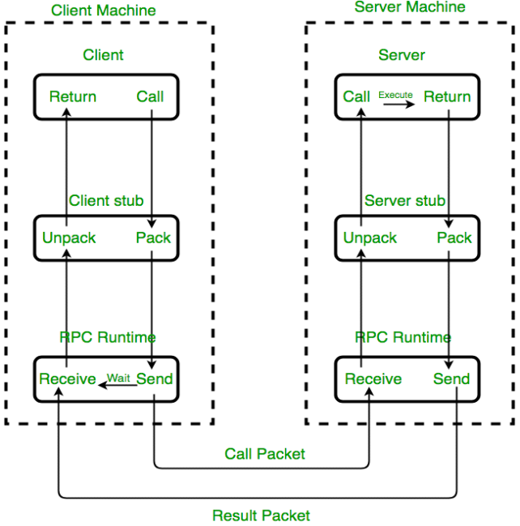

# gRPC

## RPC 远程过程调用

> 两台机器，A 机器上的程序要调用 B 机器上某程序提供的函数或方法，由于不在一个内存空 间，不能直接调用，需要通过网络来表达调用的语义和传达调用的数据。

gRPC 是一种与语言无关的高性能远程过程调用 (RPC) 框架。

## 技术优点

- 现代高性能轻量级 RPC 框架。
- 协定优先 API 开发，默认使用协议缓冲区，允许与语言无关的实现。
- 可用于多种语言的工具，以生成强类型服务器和客户端。
- 支持客户端、服务器和双向流式处理调用。
- 使用 Protobuf 二进制序列化减少对网络的使用。

这些优点使gRPC 适用于

- 效率至关重要的轻量级微服务。

- 需要处理流式请求或响应的点对点实时服务

## 定义服务端

定义协议缓冲区文件

~~~ protobuf
syntax = "proto3";

option csharp_namespace = "Greeter";

package greet;

// The greeting service definition.
service Greeter {
  // Sends a greeting
  rpc SayHello (HelloRequest) returns (HelloReply);
}

// The request message containing the user's name.
message HelloRequest {
  string name = 1;
}

// The response message containing the greetings.
message HelloReply {
  string message = 1;
}
~~~

gRPC tool帮我们生成的实现

~~~ c#
 public class GreeterService : Greeter.GreeterBase
    {
        private readonly ILogger<GreeterService> _logger;

        public GreeterService(ILogger<GreeterService> logger)
        {
            _logger = logger;
        }

        public override Task<HelloReply> SayHello(HelloRequest request, ServerCallContext context)
        {
            return Task.FromResult(new HelloReply
            {
                Message = "Hello " + request.Name
            });
        }
    }
~~~

StartUp

~~~ c#
 public class Startup
    {
        // This method gets called by the runtime. Use this method to add services to the container.
        // For more information on how to configure your application, visit https://go.microsoft.com/fwlink/?LinkID=398940
        public void ConfigureServices(IServiceCollection services)
        {
            services.AddGrpc();
        }

        // This method gets called by the runtime. Use this method to configure the HTTP request pipeline.
        public void Configure(IApplicationBuilder app, IWebHostEnvironment env)
        {
            if (env.IsDevelopment())
            {
                app.UseDeveloperExceptionPage();
            }

            app.UseRouting();

            app.UseEndpoints(endpoints =>
            {
                endpoints.MapGrpcService<GreeterService>();

                endpoints.MapGet("/", async context =>
                {
                    await context.Response.WriteAsync("Communication with gRPC endpoints must be made through a gRPC client. To learn how to create a client, visit: https://go.microsoft.com/fwlink/?linkid=2086909");
                });
            });
        }
    }
~~~

## 创建gRPC 客户端

### 1.客户端项目需要依赖的包

Install-Package Grpc.Net.Client
Install-Package Google.Protobuf
Install-Package Grpc.Tools

### 2.添加greet.proto文件

将服务端的协议文件粘贴过来(或者添加文件链接),同时改一下项目文件

~~~ xml
<ItemGroup>
<Protobuf Include="Protos\greet.proto" GrpcServices="Client" />
</ItemGroup>
~~~

3.客户端代码

~~~ c#

class Program
    {
        static async Task Main(string[] args)
        {
            using var channel = GrpcChannel.ForAddress("https://localhost:5001");

            var client = new GreeterClient(channel);

            var request = new HelloRequest { Name = "www.xcode.me" };

            var reply = await client.SayHelloAsync(request);

            Console.WriteLine(reply.Message);

            Console.ReadKey();

        }
    }
~~~

