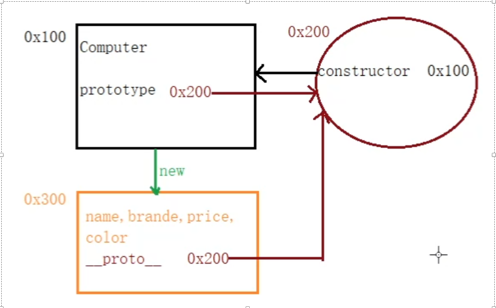
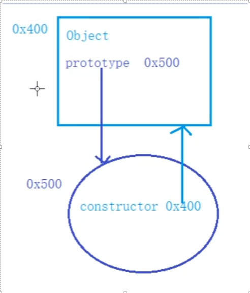
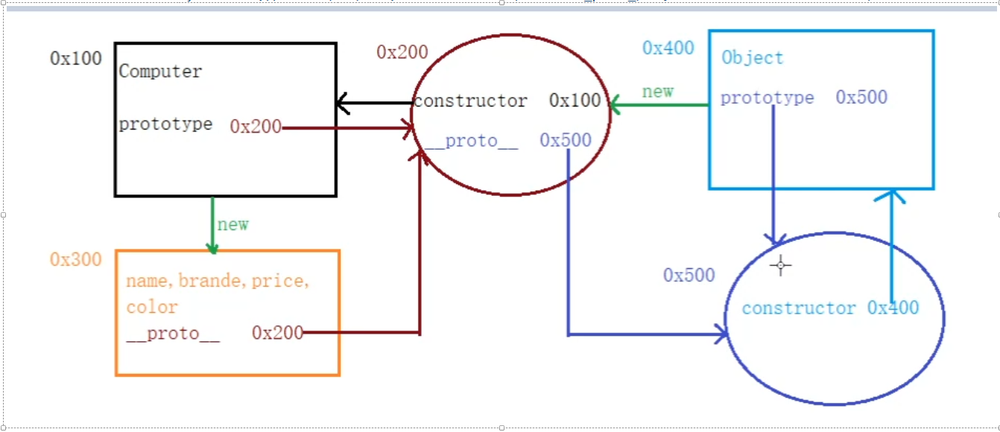
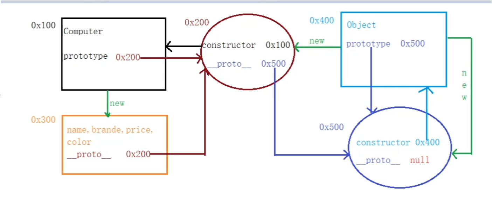
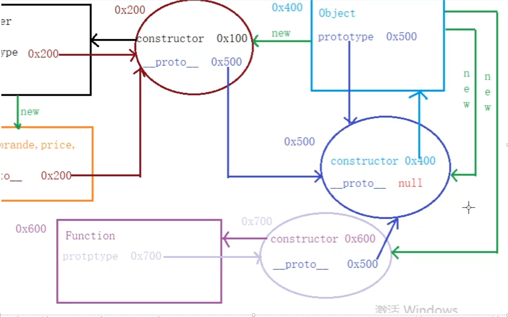
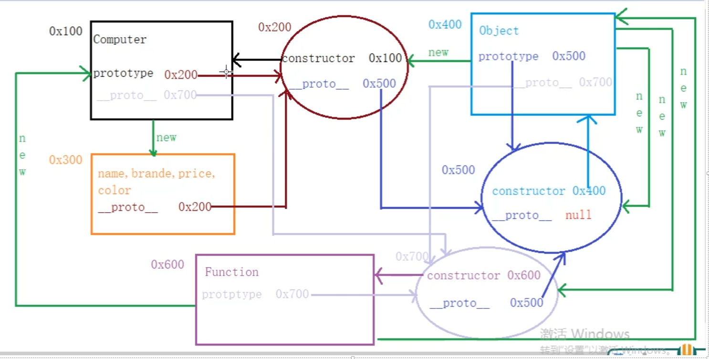
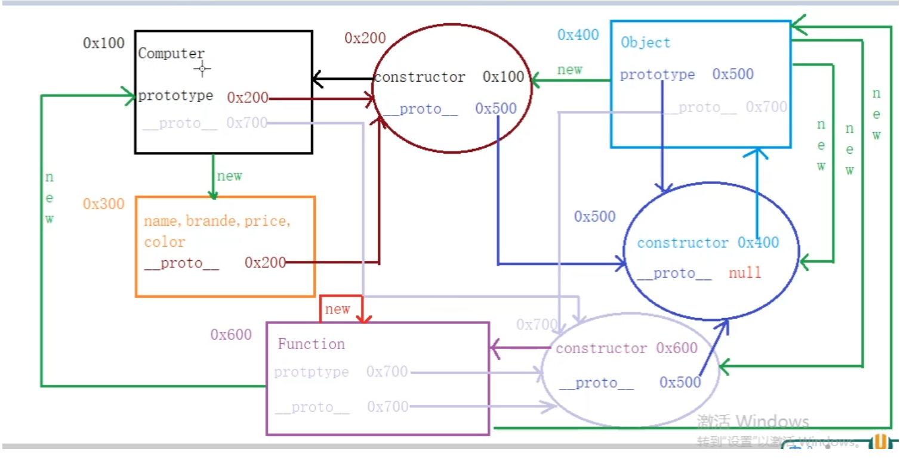

# javaScript

# 知识点

## 1.事件冒泡

 \- 事件的冒泡（bubble）

​    \- 冒泡指事件的向上传导，

​      子元素上事件触发时，会同时导致其祖先元素上的同类事件也被触发

​    \- 冒泡的存在简化了代码的编写

​    \- 但是有时我们不希望冒泡的存在，可以通过事件对象来取消冒泡：

​      1.通过cancelBubble属性来取消冒泡

​        event.cancelBubble = true;

​      2.通过stopPropagation()方法来取消冒泡

​        event.stopPropagation();


~~~ javascript
<div id="box1">
    我是div
    <span id="s1">我是span</span>
</div>

<script>
    /*
    *   冒泡（bubble）
    *       - 冒泡指的是事件的向上传导，当元素上的某个事件被触发时，
    *           其祖先元素上的相同事件也会同时被触发
    *       - 冒泡的存在在大部分情况都是有利的，简化我们的开发
    *       - 冒泡的发生只和结构有关，和元素的位置无关
    *       - 要取消事件的冒泡需要用到事件对象
    *           只需将事件对象的 cancelBubble 属性设置true，即可取消冒泡
    *           也可以通过 事件的对象 stopPropagation() 方法来停止冒泡
    * */
    // 分别为body box1 和 s1绑定单击响应函数
    let s1 = document.getElementById('s1');
    s1.onclick = function (event) {
        // event.cancelBubble = true;
        // 停止事件的冒泡
        // event.stopPropagation();
        alert('我是s1上的单击响应函数！');
    };

    let box1 = document.getElementById('box1');
    box1.onclick = function (event) {
        event.stopPropagation();
        alert('我是box1上的单击响应函数!');
    };

    document.body.onclick = function () {
        alert('我是body上的单击响应函数!');
    };
</script>

~~~


## 2.事件的绑定

~~~ javascript
<button id="btn01">按钮1</button>

<script>
    /*
    *   使用 属性 来绑定事件时，一个元素上同时只能为一个事件绑定一个响应函数
    *       如果同时为一个事件设置了多个响应函数，则后边的会覆盖掉前边
    * */

    let btn01 = document.getElementById('btn01');
    // btn01.onclick = function () {
    //     alert(1);
    // };
    //
    /*btn01.onclick = function () {
        alert(2);
    };

    btn01.onclick = null;*/

    /*
    *   可以通过 addEventListener() 来为元素设置响应函数
    *       参数：
    *           1.要绑定的事件，需要一个事件的字符串作为参数（不要on）
    *           2.事件的回调函数
    *           3.是否在捕获阶段触发事件，需要一个布尔值
    *               true 会发生事件的捕获
    *               false 不会（默认值）
    *
    *   通过该方式所绑定的事件不会互相干扰，可以为同一个事件绑定多个响应函数
    *       事件触发时，函数会按照绑定的顺序执行
    *
    *  removeEventListener()可以用来移除一个事件的响应函数
    *   - 移除时的参数必须和设置时的一模一样
    * */

    function clickHandler(event) {
        alert(1);
    }
    btn01.addEventListener('click', clickHandler);

    btn01.removeEventListener('click',clickHandler);

    //
    // btn01.addEventListener('click', function (event) {
    //     alert(2);
    // });
    //
    // btn01.addEventListener('click', function (event) {
    //     alert(3);
    // });

</script>
~~~


## 3.事件的捕获

\- 事件的传播

​    \- 事件的传播分成了三个阶段：

​      1.事件的捕获

​        \- 指事件从最外层元素开始向内部元素进行事件的捕获

​        \- 默认情况下，捕获阶段不会触发事件

​        \- 如果希望在捕获时触发事件，可以将addEventListener()的第三个参数设置为true

​      2.目标元素（触发事件的元素）

​        \- 捕获到达目标元素停止

​      3.事件的冒泡

​        \- 从目标元素开始向外层元素进行事件的冒泡

​        \- 默认情况下，冒泡时事件会被触发

 

  \- addEventListener()

​    \- 为元素添加事件的响应函数

​    \- 参数：

​      1.要绑定的事件的字符串（不要on）

​      2.事件的回调函数

​      3.是否在捕获阶段触发事件，默认为false

​      // https://developer.mozilla.org/en-US/docs/Web/Events

~~~ javascript
<div id="box1">
    <div id="box2">
        <div id="box3"></div>
    </div>
</div>

<script>
    /*
    *   关于事件的传播微软公司和网景公司有着不同的理解：
    *       微软认为，事件应该是由内向外传播，
    *           也就是先触发后代元素上的事件，在触发祖先元素的事件（事件的冒泡）
    *       网景认为，事件应该是由外向内传播
    *           先触发祖先元素的上的事件，在触发后代元素的事件（事件的捕获）
    *       W3C将两种理念进行整合，将事件分为了三个阶段：
    *           1.事件的捕获
    *               - 从最外层元素（window）向目标元素进行事件的捕获
    *           2.目标元素
    *               - 事件捕获到目标元素，捕获停止
    *           3.事件的冒泡
    *               - 从目标元素开始，向外层元素进行事件的冒泡
    *       - 默认情况下，事件是在冒泡阶段触发的
    * */

    let box1 = document.getElementById('box1');
    let box2 = document.getElementById('box2');
    let box3 = document.getElementById('box3');

    box1.addEventListener('click', function () {
        alert(1);
    }, true);

    box2.addEventListener('click', function () {
        alert(2);
    }, true);

    box3.addEventListener('click', function () {
        alert(3);
    }, true);

</script>
~~~


## 4.this的指向

1.箭头函数的this指向

 箭头函数中的this在函数创建时就以确定,

​    \*      它由外层函数（作用域）中的this来决定

​    \*      外层的this是谁，它的this就是谁

 

2.普通函数的this指向

1. 当我们以函数的形式调用一个函数时，this是window

2. 当我们以方法的形式调用一个函数是，this是调用方法的对象


## 5.原型链

- 每一个构造函数都有一个属性------即原型/原型对象prototype
- prototype是一个对象属性，其属性值为对象，称为原型对象
- 可以通过prototype来添加新的属性和方法，此时所有该构造函数创建的对象都会具有这些属性和方法
- 对象是构造函数创建出来的
- 构造函数原型对象上有一个属性constructor 是一个函数，指向这个构造函数
- 构造函数实例的隐式原型_proto_指向了这个构造函数的显式原型prototype





- Object 构造函数与其显式原型




- 由于0x200原型对象是Object构造函数new 出来的，所以图例演变为下图，0x200的_proto_隐式原型指向0x500这个原型对象




- 再找0x500的原型，由于0x500也是Object构造函数 new 出来的，所以0x500 既是Object构造函数的原型对象也是Object构造函数的实例，所以0x500对象的_proto_隐式原型应该指向Object构造函数的显式原型就是0x500 自己，但是这样就会造成死循环，所以规定Object构造函数的实例化对象的_proto_隐式原型 为null




-  Function() 是创建函数的工具，也是一个对象，也应该有其原型，其原型链的终点也是Object





- 由于构造函数也是对象，他们都是由Function 派生，是Function的实例，所以他们（Computer构造函数和Object构造函数）的_proto_也都指向0x700,所以原型链的终点也都是Object的 原型





- 那么谁new 的Function 呢？ 是Function自己




## 6.Object.create

~~~ javascript
 //新建一个对象
        var car = {
            name: '汽车',
            run: function(){
                console.log('我可以行驶')
            }
        };
        //调用 create 方法创建新对象   继承
        var Passat = Object.create(car, {
            brand: {
                //设置的是『属性的值』
                value: '帕萨特',
                //属性值是否可以修改
                writable: true,
                //属性是否可以删除
                configurable: true,
                //属性是否可以枚举(遍历)
                enumerable: true
            },
            // 价格属性
            price: {
                //get 是一个对象的方法. 无需手动调用
                get: function(){
                    console.log('Price被获取了');
                    return 280000;
                },
                //set 设置
                set: function(value){
                    //this 指的是新建的创建
                    this.jiage = value;
                    // console.log('我的值被修改了'+value);
                }
            }
        });

        // console.log(Passat);
        // Passat.brand = '大众';
        // delete Passat.brand;
        // for(var i in Passat){
        //     console.log(i);
        // }
        // console.log(Passat);
        
        //获取价格属性
        // console.log(Passat.price);
        //设置价格属性
        Passat.price = 'abcdddd';
        console.log(Passat);
~~~


## 7.Object.defineProperties


```javascript
 var sanlun = {
            name: '三轮车',
        };

        // sanlun.brand = '金蛙';
        Object.defineProperties(sanlun, {
            brand: {
                value: '金蛙',
            },
            price: {
                set: function(){

                },
                get: function(){
                    return 123;
                }
            }
        });

        console.log(sanlun.price);
```


## 8.call-apply-bind

~~~javascript
  function add(a,b,c){
            console.log(this);
            console.log(a + b + c);
        }

        //1. 立即调用
        // add(1,2,3);
        //2. call 调用
        // add.call({}, 2, 3, 4);
        //3. apply 调用
        // add.apply({name: '哈喽 apply'}, [3,4,5]);

        //4. bind 方法  返回一个新的函数
        var obj = {name: '哈喽 bind'};
        var fn = add.bind(obj);
        fn(4,5,6);
~~~


## 9.let 

~~~javascript
 //let 声明变量
        let a;          //字母数字下划线, 首字母不能为数字, 严格区分大小写, 不能使用关键字   驼峰
        let b = 100;
        let c,d,e;
        let f=100,g=200,h=300;

        //let 声明特点
        //1. 不允许重复声明
        // let star = '罗志祥';
        // let star = '小猪';
        
        //2. 块儿级作用域  if(){}  else {}  for(){}   {}   function(){}
        // if(true){
        //     let girlFriend = '周扬青';
        // }
        // console.log(girlFriend);

        //3. 不存在变量提升
        // console.log(song);
        // let song = '狐狸精';

        //4. 不影响作用域链
        // function fn(){
        //     let dance = '精武门';
        //     function b(){
        //         console.log(dance);
        //     }
        //     b();
        // }
        // fn();
~~~


## 10.数组与对象的解构赋值

~~~javascript
  //解构赋值
        // const arr = ['宋小宝','刘能','赵四','小沈阳'];
        // let [song, liu, zhao, xiao] = arr;
        // console.log(song, liu, zhao, xiao);

        //对象解构赋值
        const star = {
            name: '于谦',
            tags: ['抽烟','喝酒','烫头'],
            say: function(){
                console.log('我可以说相声');
            }
        };
        let {name, tags:[chou,he,tang], say} = star;

        // console.log(name);
        // console.log(tags);
        // console.log(say);

        console.log(chou)
        console.log(he)
        console.log(tang)
~~~

