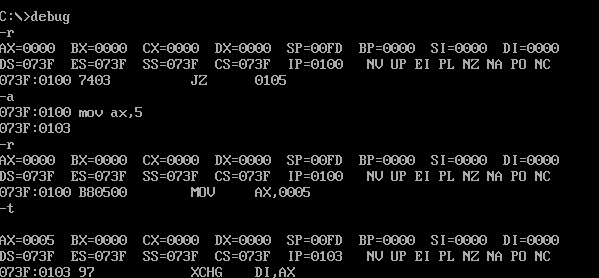

# 汇编

## 

### 1.AX ,BX ,CX ,DX 寄存器

因为他们有一个特殊的地方是 其它寄存器没有的

他们可以各自分割为 2个8位寄存器

AX = AH + AL AX的高8位 构成AH寄存器 H= high AL的低8位构成 AL寄存器 L = low

BX = BH + BL ....

CX = CH + CL ....

DX = DH + DL ....

字节型数据  byte =  8bit - 8位寄存器中

字型数据    2byte = 16bit - 16位寄存器中

一个字节是 这个字型数据中的 高位字节(AH,BH,CH,DH) ,一个字节是这个 字型数据中的 地位字节(AL,BL,CL,DL)

### 2.加深对AX ,BX ,CX ,DX 寄存器的印象

mov ax,5  ===>  mov指令是将逗号右边的数字给逗号左边

数据与寄存器之间要 保持一致性, 8位数据 给 8位寄存器, 16位数据给16位寄存器

add ax ,85H 将后面的数字与前面的相加在赋值给前面

8位寄存器 进行8位运算  保存8位数据

寄存器是相互独立的  AL就是AL  AH就是AH 不会相互影响

16位寄存器 进行16位运算  保存16位数据

### 3.表示内存地址信息的寄存器

