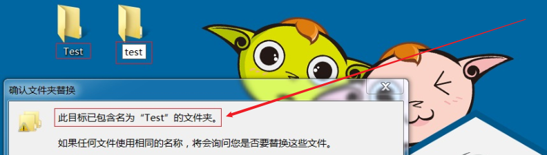
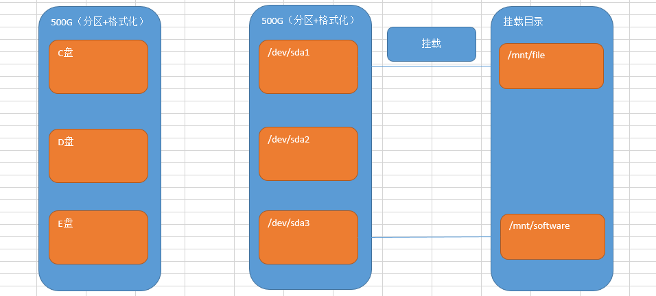

# Linux基本命令

# 一、VMware的两种备份方式

## 1、为什么要进行备份

答：保证CentOS7.6操作系统的安全，必须对操作系统进行备份

## 2、VMware有哪些系统备份方式

① 快照备份

② 克隆备份

## 3、快照备份

快照：又称还原点，就是保存在拍快照时候的系统的状态（包含了所有的内容），在后期的时候随时可以恢复。

### ☆ 拍摄快照

第一步：启动Linux的操作系统（快照备份是在系统启动后进行操作的）

第二步：单击VMware菜单栏=>虚拟机=>快照=>选择拍摄快照


第三步：输出拍摄快照的名称（为什么要有名字？为了方便后期的恢复操作）


### ☆ 恢复快照

第一步：模拟Linux操作系统故障（比如系统文件被删除、系统损坏等等）

第二步：选择VMware菜单栏=>虚拟机=>快照=>恢复到快照（根据拍摄时的名称进行恢复）


### ☆ 总结

注意：侧重在于短期备份，需要频繁备份的时候都可以使用快照，做快照的时候虚拟机中操作系统一般处于开启状态

## 4、克隆备份

克隆：就是复制的意思。

### ☆ 克隆备份

<font color="red">注意事项：克隆备份不同于快照备份，其要求克隆时，操作系统必须处于关闭状态。</font>

第一步：使用关机按钮或相关的关机命令对Linux进行关机操作


第二步：在要克隆的操作系统菜单上，鼠标右键，选择管理，选择克隆


第三步：根据向导进行克隆备份

下一步、下一步，选择克隆类型，一定要选择完整克隆


设置克隆机的名称以及存储路径（此路径剩余可用空间必须>=10G）


克隆完成后，效果如下图所示：产生了一个全新的操作系统


### ☆ 总结

克隆侧重长期备份，做克隆的时候是必须得关闭操作系统（了解）

应用场景：快速创建多台计算机

## 5、快照与克隆的区别

克隆与快照的最大的区别：==克隆之后是2 台机器，而快照之后依旧是1 台机器（类似windows的还原点）。后期的危险操作前建议使用快照。==

# 二、Linux系统使用注意

## 1、Linux严格区分大小写

```powershell
Linux 和Windows不同，Linux严格区分大小写的，包括文件名和目录名、命令、命令选项、配置文件设置选项等。

例如，Win7 系统桌面上有文件夹叫做Test，当我们在桌面上再新建一个名为 test 的文件夹时，系统会提示文件夹命名冲突；
```

Windows演示：



Linux演示：


由以上图解可知：Linux是一个非常严谨的操作系统，严格区分大小写。

## 2、Linux文件"扩展名"

> 在Linux操作系统中，与Windows不同，其文件的类型不是通过扩展名来进行区分的！

我们都知道，Windows 是依赖扩展名区分文件类型的，比如，".txt" 是文本文件、".exe" 是执行文件，但 Linux 不是。

 Linux 系统通过==权限位标识==来确定文件类型，常见的文件类型有普通文件、目录、链接文件、块设备文件、字符设备文件等几种。Linux 的可执行文件就是普通文件被赋予了可执行权限。


Linux系统中常见的后缀名称：

```powershell
Linux 中的一些特殊文件还是要求写 "扩展名" 的，但 Linux 不依赖扩展名来识别文件类型，写这些扩展名是为了帮助运维人员来区分不同的文件类型。

这样的文件扩展名主要有以下几种：
压缩包：Linux 下常见的压缩文件名有 *.gz、*.bz2、*.zip、*.tar.gz、*.tar.bz2、*.tgz 等。

为什么压缩包一定要写扩展名呢？很简单，如果不写清楚扩展名，那么管理员不容易判断压缩包的格式，虽然有命令可以帮助判断，但是直观一点更加方便。就算没写扩展名，在 Linux 中一样可以解压缩，不影响使用。

二进制软件包：CentOS 中所使用的二进制安装包是 RPM 包，所有的 RPM 包都用".rpm"扩展名结尾，目的同样是让管理员一目了然。=> 类似Windows中的exe文件

程序文件：Shell 脚本一般用 ".sh" 扩展名结尾。=> check_network.sh

网页文件：网页文件一般使用 ".php" 等结尾，不过这是网页服务器的要求，而不是 Linux 的要求。
.html/.css/.js/.jsp/.php/.py => 网页文件
```
> ① Linux操作系统不以“扩展名”来判断文件的类型，而是通过权限位标识符来进行判断

> ② 有一些特殊的文件，有扩展名称=>压缩包、二进制软件包、程序文件、网页文件

## 3、Linux中所有内容以文件形式保存

在Linux系统中，一切皆文件！

> 在Windows是文件的，在Linux下也是文件。在Windows中不是文件的，在Linux系统中也是文件。

问题：我们目前还没有学习权限标识符，怎么判断文件的类型呢？

答：可以通过文件的颜色


然后使用ls命令，查看文件的颜色

```powershell
# ls
l : L的小写形式
```

普通文件：通过ls命令查看时，如果显示<font color="red">黑色</font>，代表其是一个普通的文件

文件夹：通过ls命令查看时，如果显示<font color="red">天蓝色</font>，代表是一个文件夹

## 4、Linux中存储设备都必须在挂载之后才能使用



Windows：分区+格式化

Linux操作系统：分区+格式化+挂载，存储设备必须挂载后才能使用（硬盘、光盘、U盘）

> mount命令： mount   空格   /dev/sda1  空格  /mnt/file

# 三、Linux系统的目录结构（重要）

## 1、Linux分区与Windows分区

Linux 系统不同于 Windows，没有 C 盘、D 盘、E 盘那么多的盘符，只有一个==根目录（/）==，所有的文件（资源）都存储在以==根目录（/）==为树根的==树形==目录结构中。

Windows：


Linux：


## 2、Linux系统文件架构


 在 Linux 根目录（/）下包含很多的子目录，称为一级目录。
例如 bin、boot、dev 等。

同时，各一级目录下还含有很多子目录，称为二级目录。
例如 /bin/bash、/bin/ed 等。

## 3、Linux系统的文件目录用途

/bin：系统命令目录

/sbin：超级命令目录，只能超级管理员可以执行的命令

/boot：系统目录，类似于Windows中的C盘

/dev ：设备文件目录，硬盘、光驱、U盘都属于设备文件，/dev/sr0代表光驱设备。注意，次目录下的文件没有办法直接使用，必须先挂载

/etc ：非常重要，代表系统的配置文件目录。大部分软件安装完成后，其配置文件都存放在此目录

/home：普通用户的家目录，用户登录后会自动切换到此目录

/root：超级管理员的家目录，超级管理员登录后会自动切换到此目录

/media：挂载目录，早期Linux挂载目录，用于挂载光盘以及软盘

/mnt：挂载目录，用来挂载额外的设备，如 U 盘、移动硬盘和其他操作系统的分区

/opt ：第三方软件目录，这个目录是放置和安装其他软件的位置，手工安装的源码包软件都可以安装到这个目录中。不过笔者还是习惯把软件放到 /usr/local/ 目录中，也就是说，/usr/local/ 目录也可以用来安装软件

/usr ：系统程序目录，类似Windows中的Program Files

/proc：虚拟文件系统。该目录中的数据并不保存在硬盘上，而是保存到内存中。主要保存系统的内核、进程、外部设备状态和网络状态等。

/tmp ：临时文件目录，在该目录下，所有用户都可以访问和写入。建议此目录中不能保存重要数据，最好每次开机都把该目录清理

/var ：经常变化的文件目录，网页文件、数据文件、日志文件

# 四、Linux入门级命令

## 1、开启终端

问题：什么是终端（Terminal）

答：Linux操作系统中用于输入命令的地方


打开后，效果如下图所示：


## 2、Linux命令格式

什么是Linux 的命令？

答：就是指在Linux 终端（命令行）中输入的内容就称之为命令。

一个完整的命令的标准格式：Linux 通用的格式

```powershell
# 命令（空格） [选项]（空格）[参数]
```

但是有些命令比较特殊，可能没有选项也没有参数

```powershell
# pwd
```

还有一些命令，有命令有选项，但是没有参数

```powershell
# ls -l
```

还有一些命令，命令+选项+参数全都有

```powershell
# tail -n 3 readme.txt
```

## 3、扩展：Linux下的命令补全

键盘上有一个按键：Tab键


当我们在Linux系统的终端中，输入命令时，可以无需完整的命令，只需要记住命令的前几个字母即可，然后按Tab键，系统会自动进行补全操作。

```powershell
# syst + Tab键
# systemc + Tab键
# systemctl
```

有些命令可能都以某几个字母开头，这个时候，只需要按两次Tab键，其就会显示所有命令。

```powershell
# clea + Tab键 + Tab键
```

> Tab键的功能特别强大：其不仅可以补全命令还可以补全Linux的文件路径

## 4、切换用户

基本语法：

```powershell
# su - root
Password:123456
[root@localhost ~]# 切换成功
```

> 扩展：-横杠作用是什么？答：-横杠代表切换用户的同时，切换用户的家目录

## 5、uname命令

主要功能：获取计算机操作系统相关信息

基本语法：

```powershell
# uname -a
选项说明：
-a ：all缩写，代表显示所有信息，获取全部的系统信息（类型、全部主机名、内核版本、发布时间、开源计划）
```

## 6、ls命令

### ☆ 用法一

主要功能：ls完整写法list show，以平铺的形式显示当前目录下的文件信息

基本语法：

```powershell
# ls
```

### ☆ 用法二

主要功能：显示其他目录下的文件信息

```powershell
# ls 其他目录的绝对路径或相对路径
```

> 扩展：ls后面跟的路径既可以是绝对路径也可以是相对路径

**绝对路径**：不管当前工作路径是在哪，==目标路径都会从“/”磁盘根下开始==。
案例：访问itheima用户的家目录，查看有哪些文件

```powershell
# ls /home/itheima
```

<font color="red">绝对路径必须以左斜杠开头，一级一级向下访问，不能越级</font>


**相对路径**：除绝对路径之外的路径称之为相对路径，相对路径得有一个相对物（当前工作路径）。

只要看到路径以“/”开头则表示该路径是绝对路径，除了以“/”开头的路径称之为相对路径。

当前位置：/home/itheima目录下

../：表示上级目录（上一级）

./ ：表示当前目录（同级），普通文件./可以省略，可执行文件（绿色）必须加./

文件夹名称/：表示下级目录（下一级），注意这个斜杠/

### ☆ 用法三

基本语法：

```powershell
# ls [选项] [路径]
选项说明：
-l ：ls -l，代表以详细列表的形式显示当前或其他目录下的文件信息(简写命令=>ll)
-h ：ls -lh，通常与-l结合一起使用，代表以较高的可读性显示文件的大小(kb/mb/gb)
-a ：ls -a，a是all缩写，代表显示所有文件（也包含隐藏文件=>大部分以.开头）
```

计算机中的单位：

```powershell
# 1TB = 1024GB
# 1GB = 1024MB
# 1MB = 1024KB
# 1KB（千字节） = 1024B（字节）
```

## 7、pwd命令

主要功能：pwd=print working directory，打印当前工作目录（告诉我们，我们当前位置）

基本语法：

 ```powershell
# pwd
 ```

## 8、cd命令

主要功能：cd全称change directory，切换目录（从一个目录跳转到另外一个目录）

基本语法：

```powershell
# cd [路径]
选项说明：
路径既可以是绝对路径，也可以是相对路径
```

案例一：切换到/usr/local这个程序目录

```powershell
# cd /usr/local
```

案例二：比如我们当前在/home/itheima下，切换到根目录/下

```powershell
# cd /home/itheima
# cd ../../
```

案例三：当我们在某个路径下，如何快速回到自己的家目录

```powershell
# cd
或
# cd ~
```

## 9、clear命令

主要功能：清屏

基本语法：

```powershell
# clear
```

## 10、reboot命令

主要功能：立即重启计算机

基本语法：

```powershell
# reboot
```

## 11、shutdown命令

主要功能：立即关机或延迟关机

立即关机基本语法：

```powershell
# shutdown -h 0或now
# shutdown -h 0
# shutdown -h now
选项说明：
-h ：halt缩写，代表关机
```

> 在Linux系统中，立即关机除了使用shutdown -h 0以外还可以使用halt -p命令

延迟关机基本语法：

```powershell
# shutdown -h 分钟数
代表多少分钟后，自动关机
```

案例1：10分钟后自动关机

```powershell
# shutdown -h 10
```

案例2：后悔了，取消关机

```powershell
光标一直不停的闪，取消关机
# 按Ctrl + C（CentOS6，中断关机。CentOS7中还需要使用shutdown -c命令）
# shutdown -c
```

## 12、type命令

主要功能：主要用来结合help命令，用于判断命令的类型（属于内部命令还是外部命令）

基本语法：

```powershell
# type 命令
内部命令：命令 is a shell builtin
外部命令：没有显示以上信息的就是外部命令
```

## 13、history命令

主要功能：显示系统以前输入的前1000条命令

基本语法：

```powershell
# history
```

## 14、hostnamectl命令

主要功能：用于设置计算机的主机名称（给计算机起个名字），此命令式CentOS7新增的命令。

hostnamectl ： hostname + control

### ☆ 获取计算机的主机名称

```powershell
# hostname	CentOS6
# hostnamectl  CentOS7
```

### ☆ 设置计算机的主机名称

Centos7中主机名分3类，静态的（static）、瞬态的（transient）、和灵活的（pretty）。

① 静态static主机名称：电脑关机或重启后，设置的名称亦然有效

② 瞬态transient主机名称：临时主机名称，电脑关机或重启后，设置的名称就失效了

③ 灵活pretty主机名称：可以包含一些特殊字符

CentOS 7中和主机名有关的文件为/etc/hostname，它是在系统初始化的时候被读取的，并且内核根据它的内容设置瞬态主机名。

> 更改主机名称，让其永久生效？① 使用静态的 ② 改/etc/hostname文件

#### ① 瞬态主机名称（临时设置）

```powershell
# hostnamectl --transient set-hostname 主机名称
主机名称 建议遵循 FQDN协议（功能+公司域名）
web01.itcast.cn
web02.itcast.cn
```

案例：临时设置主机名称为yunwei.itcast.cn

```powershell
# hostnamectl --transient set-hostname yunwei.itcast.cn
# su 立即生效
```

#### ② 静态主机名称（永久生效）

```powershell
# hostnamectl --static set-hostname 主机名称
温馨提示：--static也可以省略不写
```

案例：把计算机的主机名称永久设置为yunwei.itcast.cn

```powershell
# hostnamectl --static set-hostname yunwei.itcast.cn
# su 立即生效
```

#### ③ 灵活主机名称（主机名称可以添加特殊字符）

```powershell
# hostnamectl --pretty set-hostname 主机名称（包含特殊字符）
```

案例：把计算机的主机名称通过灵活设置，设置为yunwei's server01

```powershell
# hostnamectl --pretty set-hostname "yunwei's server01"
查看灵活的主机名称
# hostnamectl --pretty
```


# Linux下yum源配置实战

# 一、Linux下软件包的管理

## 1、软件安装方式

① RPM包管理（需要单独解决依赖问题）

② YUM包管理（需要有网络及YUM仓库的支持，会自动从互联网下载软件，自动解决依赖）

③ 源码安装（安装过程比较复杂，源码安装三步走。优点：定制性很强）

软件：主线版（mainline），稳定版（stable）

## 2、源码安装的配置过程

在Linux系统中，源码安装一共分为三步（三步走）：

第一步：配置过程（配置软件的安装路径）

第二步：编译过程（把软件由源代码编译成可以安装的程序）

第三步：安装过程（把编译后的程序进行安装）

```powershell
# ./configure && make && make install
```

## 3、详解源码安装的配置过程（定制）

```powershell
# cd 软件源码包
# ./configure [选项]
# ./configure --help

--prefix=... Directories to put files in /usr/local 软件家目录
--bindir=... $prefix/bin 	命令的目录
--etcdir=... $prefix/etc 	配置文件的目录 httpd => /etc/httpd/httpd.conf
--mandir=... $prefix/share/man man	文档路径
--locale=... $prefix/share/locale 	语言编码
...
```

## 4、详解编译过程

```powershell
# make
```

> 在Linux操作系统中，make主要功能就是将其他语言的源代码打包成Linux可以识别安装的程序。编译过程需要一个gcc软件（开发工具）的支持！

## 5、安装过程

```powershell
# make install
```

## 6、axel多线程下载软件源码安装

第一步：获取axel多线程下载软件

第二步：上传axel软件包到Linux系统中

第三步：安装axel软件(源码安装三步走=>配置+编译+安装)

① 对软件进行解压缩操作

```powershell
# tar -zxf axel-2.4.tar.gz
或
# tar -xf axel-2.4.tar.gz
```

② 使用cd命令切换到axel目录中

```powershell
# cd axel-2.4
```

③ 对axel软件进行配置（不采用默认配置）

```powershell
# ./configure --help
Usage: ./configure [OPTIONS]
Option          Description                             Default
--prefix=...    Directories to put files in             /usr/local
--bindir=...                                            $prefix/bin
--etcdir=...                                            $prefix/etc
--mandir=...                                            $sharedir/man
--locale=...                                            $sharedir/locale
```

设置axel软件的安装路径为/opt/axel

```powershell
# ./configure --prefix=/opt/axel
```

④ 对axel软件进行编译与安装

```powershell
# make
# make install
或
# make && make install
&& ：逻辑与，如果make编译成功会立即执行右边的make install安装程序，如果make编译失败，则以上程序会停止执行，然后抛出错误。
```

第四步：测试与使用

```powershell
[root@yunwei ~]# axel http://mirrors.163.com/centos/7/os/x86_64/RPM-GPG-KEY-CentOS-7
bash: axel: command not found...
```

出现以上问题的主要原因在于：我们没有采用默认的安装方式，所以导致当我们执行axel命令时，其找不到对应的软件。

第五步：解决命令无法访问问题

```powershell
第一种方式：采用软链接形式（类似Windows中的快捷方式）
第二种方式：使用环境变量（重要，Linux中的环境变量）
```

## 7、使用软链接解决command not found

```powershell
# which axel
/usr/bin/which: no axel in (/usr/local/sbin:/usr/local/bin:/usr/sbin:/usr/bin:/root/bin)

# ll /opt/axel/bin
axel

解决方案：给/opt/axel/bin/axel创建一个快捷方式到/usr/local/bin
# ln -s /opt/axel/bin/axel /usr/local/bin/axel 

基本语法：
# ln -s  源文件路径 软链接路径

# axel http://mirrors.163.com/centos/7/os/x86_64/RPM-GPG-KEY-CentOS-7
```

## 8、使用环境变量解决command not found

环境变量

```powershell
终端 => 命令 => 系统的环境变量(PATH => /etc/profile) => 一些命令的存放路径
```

axel多线程下载软件，通过源码的方式安装成功后，由于没有使用默认的安装路径，导致axel这个命令没有出现在系统的环境变量中，所以其会出现command not found。

第一步：查询当前系统的环境变量

```powershell
# echo $PATH
/usr/local/sbin:/usr/local/bin:/usr/sbin:/usr/bin:/root/bin
```

第二步：把axel所在目录添加到环境变量

```powershell
① 使用vim编辑/etc/profile文件，追加到最后一行
# vim /etc/profile
...
export PATH=$PATH:/opt/axel/bin
# source /etc/profile			=>   		代表让以上配置立即生效

② 使用echo命令向/etc/profile文件中追加一行
# echo 'export PATH=$PATH:/opt/axel/bin' >> /etc/profile
# source /etc/profile
```

第三步：测试axel命令是否可以使用

```powershell
# axel http://mirrors.163.com/centos/7/os/x86_64/RPM-GPG-KEY-CentOS-7
```

## 9、解决源码安装软件手册找不到问题

问题重现：

```powershell
[root@localhost axel]# man axel
No manual entry for axel
原因：找不到指定的man文档
```

解决方案：

```powershell
[root@localhost axel]# vim /etc/man.config
...
增加如下内容：
MANPATH /opt/axel/share/man
```

## 10、卸载源码安装的软件

```powershell
第一步：进入到源码的安装包中
# cd axel-2.4
# make uninstall	=>   安装软件的安装包等程序
# make distclean    =>   卸载编译与配置过程
第二步：删除软件的目录
# rm -rf /opt/axel
```

# 二、YUM源概述

## 1、yum源作用

==软件包管理器==，类似360的软件管家


## 2、yum源优点

RPM安装（下载软件、单独安装、需要解决依赖关系）

源码安装（下载软件的源码包，解压，进入目录=>配置+编译+安装）

yum源：相当于rpm软件包管理的升级版

能够==解决软件包之间的依赖关系==，提高运维人员的工作效率。

> yum源底层还是基于RPM进行软件安装操作的，所以yum安装软件后，我们也可以通过rpm  -qa  |grep  软件名称

## 3、yum源分类

### ☆ 本地yum源

yum仓库在==本地==（系统光盘/镜像文件） =>  不需要网络的支持

### ☆ 网络yum源

yum仓库不在本地，在==远程==

- 国内较知名的网络源（aliyun源，163源，sohu源，知名大学开源镜像等）

  ​	阿里源：<https://opsx.alibaba.com/mirror>

  ​	网易源：<http://mirrors.163.com/>

  ​	搜狐源：<http://mirrors.sohu.com/>

  ​	清华源：<https://mirrors.tuna.tsinghua.edu.cn/>

- 国外较知名的网络源（centos源、redhat源、扩展[^epel]源等）

- ==特定软件==相关的网络源（Nginx、MySQL、Zabbix等）

## 4、本机yum源备份（重要）

第一步：使用cd命令切换到/etc/yum.repos.d目录

```powershell
# cd /etc/yum.repos.d/
```

第二步：对所有的仓库文件进行备份

```powershell
# tar -zcf repo.tar.gz *.repo
```

第三步：删除所有的以.repo结尾的仓库文件

```powershell
# rm -rf *.repo
```

# 三、本地YUM源配置

## 1、本地YUM配置

① 使用光盘镜像作为YUM源仓库

② 下载很多软件，使用软件包作为YUM源仓库

## 2、使用光盘镜像作为YUM源仓库

第一步：在VMware系统中装在CentOS7.6系统的光盘镜像

 

第二步：把光盘挂载到某个目录下

```powershell
# cd ~

# rm -rf /mnt/*
# mount -o ro /dev/sr0 /mnt
选项说明：
-o ：挂载方式，ro代表以readonly=>只读的方式进行挂载
              rw代表以read/write=>读写的方式进行挂载
# lsblk
NAME            MAJ:MIN RM  SIZE RO TYPE MOUNTPOINT
sda               8:0    0   20G  0 disk
├─sda1            8:1    0    1G  0 part /boot
└─sda2            8:2    0   19G  0 part
  ├─centos-root 253:0    0   17G  0 lvm  /
  └─centos-swap 253:1    0    2G  0 lvm  [SWAP]
sr0              11:0    1  4.3G  0 rom  /mnt
```

> 卸载或解挂可以使用umount /mnt

第三步：把光盘挂载添加到开机启动文件中

```powershell
# chmod +x /etc/rc.local
# echo 'mount -o ro /dev/sr0 /mnt' >> /etc/rc.local
```

> /etc/rc.local，属于系统的开机启动文件。系统启动后，会自动加载并执行这个文件

第四步：编写本地YUM仓库文件

```powershell
# cd /etc/yum.repos.d/
创建一个以*.repo结尾的文件，名称任意
# vim local.repo
[local]
name=local yum
baseurl=file:///mnt
gpgcheck=0
enabled=1
# yum clean all
# yum makecache
# yum repolist all

注：file://本地协议路径，后面跟仓库的具体路径
```

> yum仓库的标准格式
>
> [仓库标识名称]，名称任意，在一个文件中可以拥有多个标识
>
> name=仓库名称
>
> baseurl=仓库的路径，支持多种格式，file://本地路径，ftp://，http://或https://
>
> gpgcheck=gpg密钥，值可以是0（代表不检测），1（代表检测，如果是1，下方还要定义一个gpgkey=密钥连接）
>
> enabled=是否启动当前仓库，值可以0，也可以是1，默认为1，代表启动仓库

第五步：测试本地YUM仓库是否可用

```powershell
# yum install httpd -y
```

## 3、扩展man 5

在Linux系统中，给定我们一个配置文件，怎么查询这个文件中每一个选项的作用呢？

```powershell
# man 命令
```

扩展：man  5   配置文件名称

```powershell
# man 5 yum.conf
```


# 四、网络YUM源配置

## 1、网络YUM源的分类

① 使用比较知名平台的YUM源（阿里云、腾讯、清华）

② 有些特定软件（如Nginx、MySQL、Zabbix等等）需要根据官网文档自定义网络YUM源

## 2、使用知名平台的YUM源

​	阿里源：<https://opsx.alibaba.com/mirror>

​	网易源：<http://mirrors.163.com/>

​	搜狐源：<http://mirrors.sohu.com/>

​	清华源：<https://mirrors.tuna.tsinghua.edu.cn/>

腾讯源、华为源...

> 百度搜索 => 华为 mirror镜像源

案例：配置阿里云的yum源

第一步：百度，搜索你想要的YUM源，进入官网，找到CentOS


第二步：根据官网提示，配置阿里云的YUM源

```powershell
# mv /etc/yum.repos.d/CentOS-Base.repo /etc/yum.repos.d/CentOS-Base.repo.backup

# wget -O /etc/yum.repos.d/CentOS-Base.repo http://mirrors.aliyun.com/repo/Centos-7.repo

# yum clean all
# yum makecache
```


```shell
wget -O /etc/yum.repos.d/CentOS-Base.repo https://mirrors.aliyun.com/repo/Centos-7.repo
```


## 3、扩展：EPEL源配置

什么是EPEL源？

答：EPEL是对官网源的一个扩展。

CentOS-Base.repo文件 => 基础源（官方在带的YUM源）

epel.repo文件 => 扩展源，是对官方YUM源的一个补充

```powershell
# yum install epel-release -y
```

比如：会跑的小火车就是在epel源中

```powershell
# yum install sl -y
# sl
```

## 4、特定软件的YUM源配置

比如特殊的几个软件，如Nginx、MySQL、Zabbix

Nginx：http://www.nginx.org

MySQL：https://www.mysql.com/

Zabbix：https://www.zabbix.com/

找到官方文档，把YUM源配置，写入到一下文件中（repo文件）

```powershell
# cd /etc/yum.repos.d
# vim nginx.repo
[nginx-stable]
name=nginx stable repo
baseurl=http://nginx.org/packages/centos/$releasever/$basearch/
gpgcheck=1
enabled=1
gpgkey=https://nginx.org/keys/nginx_signing.key
module_hotfixes=true
```

清理缓存：

```powershell
# yum clean all
# yum makecache
```

安装Nginx：

```powershell
# yum install nginx -y
```

# 五、自建YUM源仓库

## 1、缓存安装软件包

什么时候需要缓存软件？

- 下次还需要安装相同版本的软件包
- 由于网络原因导致网络安装非常慢，将软件包缓存下来，配置本地仓库

## 2、如何缓存软件安装包

```powershell
# vim /etc/yum.conf
[main]
cachedir=/var/cache/yum/$basearch/$releasever	定义软件包的缓存路径
keepcache=1			1开启缓存；0关闭
debuglevel=2
logfile=/var/log/yum.log
...
```

## 3、把软件及依赖软件全部下载到某个路径

只下载不安装软件：

```powershell
# yum install --downloadonly --downloaddir=保存路径 软件名称
```

案例：下载samba软件及依赖软件

```powershell
# mkdir /soft
# yum install --downloadonly --downloaddir=/soft samba
```

## 4、自定义YUM仓库

第一步：在系统中安装createrepo制作仓库的软件

```powershell
# yum install createrepo -y
```

第二步：把/soft文件夹做成一个本地的自建仓库

```powershell
# createrepo /soft
```

第三步：在/etc/yum.repos.d目录中创建一个soft.repo的仓库

```powershell
# cd /etc/yum.repos.d/
# vim soft.repo
[soft]
name=soft yum
baseurl=file:///soft
gpgcheck=0
enabled=1
```

清理缓存+重建缓存：

```powershell
# yum clean all
# yum makecache
```


